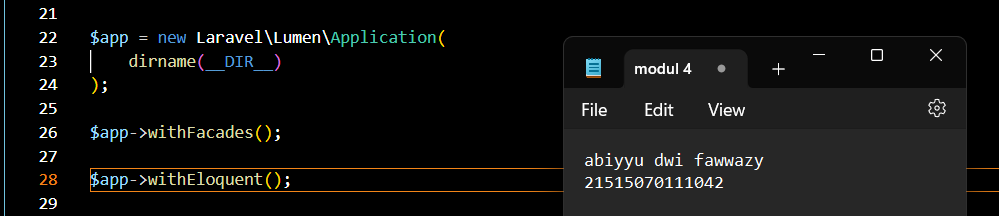
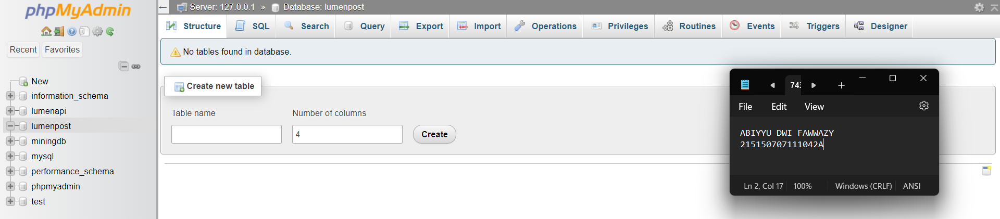
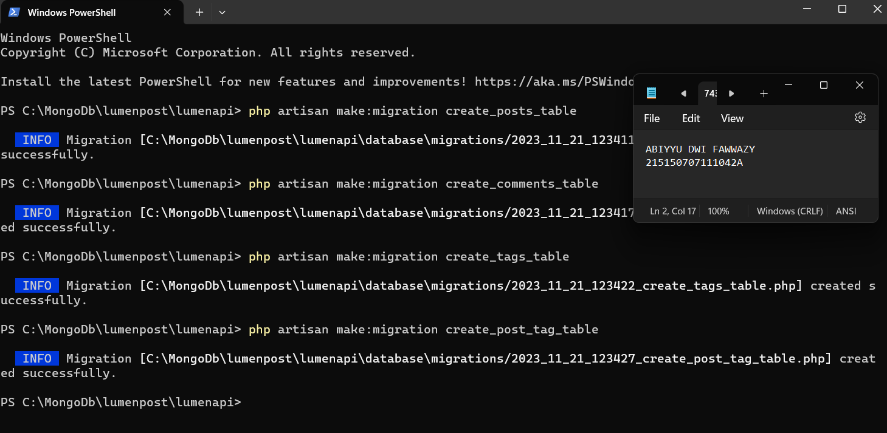
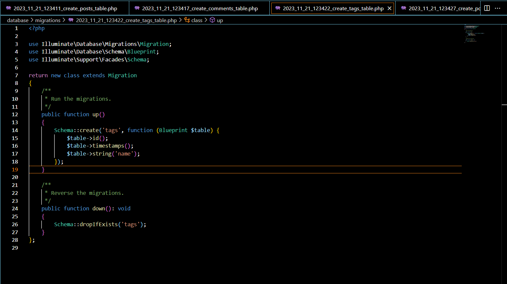
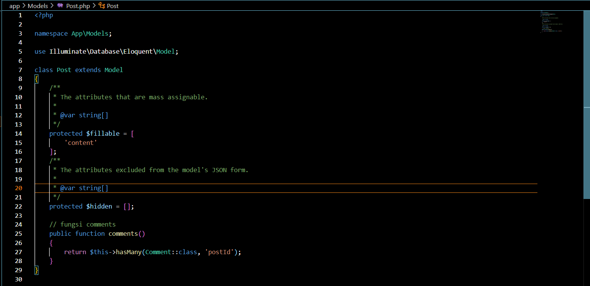
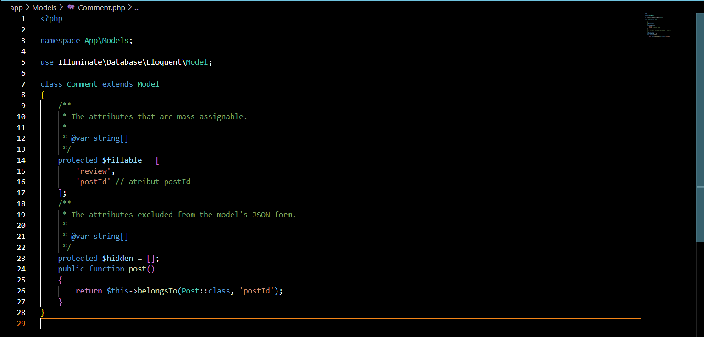
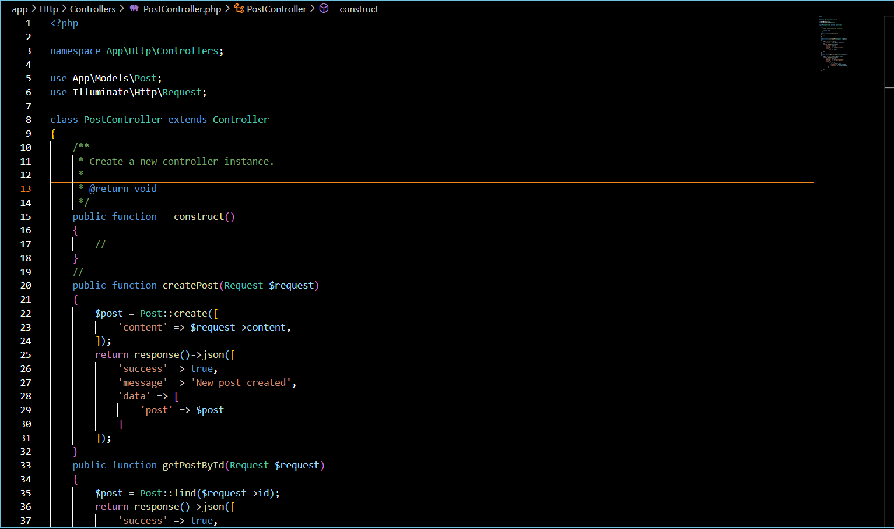

Lakukan npm init untuk mengenerate file package.json dengan menggunakan command npm init -y

Lakukan instalasi express, mongoose, dan dotenv dengan menggunakan command npm i express mongoose dotenv

Buatlah file index.js pada root folder dan masukkan kode di bawah ini
require('dotenv').config();
const express = require('express');
const mongoose = require('mongoose');
const app = express();
app.use(express.json());
app.get('/', (req, res) => {
res.status(200).json({
message: '<nama>,<nim>'
})
})
const PORT = 8000;
app.listen(PORT, () => {
console.log(`Running on port ${PORT}`);
})

Lakukan pembuatan file .env dan masukkan baris berikut
PORT=5000

Setelah itu ubahlah kode pada listening port menjadi berikut dan coba jalankan aplikasi kembali
const PORT = process.env.PORT || 8000;
app.listen(PORT, () => {
console.log(`Running on port ${PORT}`);
})

Copy connection string yang terdapat pada compas atau atlas dan paste kan pada .env seperti berikut
MONGO_URI=mongodb://localhost:27017

Tambahkan baris kode berikut pada file index.js
require('dotenv').config();
const express = require('express');
const mongoose = require('mongoose');
mongoose.connect(process.env.MONGO_URI);
const db = mongoose.connection;
db.on('error', (error) => {
console.log(error);
});
db.once('connected', () => {
console.log('Mongo connected');
})

Lakukan pembuatan direktori routes di tingkat yang sama dengan index.js
Buatlah file book.route.js di dalamnya
Tambahkan baris kode berikut untuk fungsi getAllBooks
const router = require('express').Router();
router.get('/', function getAllBooks(req, res) {
res.status(200).json({
message: 'mendapatkan semua buku'
})
})
module.exports = router;

Lakukan import book.route.js pada file index.js dan tambahkan baris kode berikut
require('dotenv').config();
const express = require('express');
const mongoose = require('mongoose');

const db = mongoose.connection;
const app = express();

const bookRoutes = require('./routes/book.route'); 

mongoose.connect(process.env.MONGO_URI);

db.on('error', (error) => {
    console.log(error);
});

db.once('connected', () => {
    console.log('Mongo connected');
})

app.get('/', (req, res) => {
    res.status(200).json({
        message: 'Abiyyu Dwi Fawwazy, 215150707111042'
    })
})
    app.use(require('body-parser').json());
    app.use('/books', bookRoutes); //
    
    const PORT = process.env.PORT || 8000;
    app.listen(PORT, () => {
    console.log(`Running on port ${PORT}`);
    })

Uji salah satu endpoint dengan Postman

Salin baris kode dari routes untuk fungsi getAllBooks
function getAllBooks(req, res) {
res.status(200).json({
message: 'mendapatkan semua buku'
})
};
module.exports = {
getAllBooks,
}

Lakukan hal yang sama untuk getOneBook, createBook, updateBook, dan deleteBook

Lakukan import book.controller.js pada file book.route.js
const router = require('express').Router();
const book = require('../controllers/book.controller'); //
...
module.exports = router;

Lakukan perubahan pada fungsi agar dapat memanggil fungsi dari book.controller.js
const router = require('express').Router();
const book = require('../controllers/book.controller');
router.get('/', book.getAllBooks);
router.get('/:id', book.getOneBook);
router.post('/', book.createBook);
router.put('/:id', book.updateBook);
router.delete('/:id', book.deleteBook);
module.exports = router;

Lakukan pengujian kembali, pastikan response tetap sama

Lakukan pembuatan direktori models di tingkat yang sama dengan index.js
Buatlah file book.model.js di dalamnya
Tambahkan baris kode berikut sesuai dengan tabel di atas
const mongoose = require('mongoose');
const bookSchema = new mongoose.Schema({
title: {
type: String
},
author: {
type: String
},
year: {
type: Number
},
pages: {
type: Number
},
summary: {
type: String
},
publisher: {
type: String
}
})
module.exports = mongoose.model('book', bookSchema);

Hapus semua data pada collection books

Lakukan import book.model.js pada file book.controller.js
const Book = require('../models/book.model');

Lakukan perubahan pada fungsi createBook
const Book = require('../models/book.model');
...
async function createBook(req, res) {
const book = new Book({
title: req.body.title,
author: req.body.author,
year: req.body.year,
pages: req.body.pages,
summary: req.body.summary,
publisher: req.body.publisher,
})
try {
const savedBook = await book.save();
res.status(200).json({
message: 'membuat buku baru',
book: savedBook,
})
} catch (error) {
res.status(500).json({
message: 'kesalahan pada server',
error: error.message,
})
}
}

Buatlah dua buah buku dengan data di bawah ini dengan Postman
{
"title": "Dilan 1990",
"author": "Pidi Baiq",
"year": 2014,
"pages": 332,
"summary": "Mirea, anata wa utsukushī",
"publisher": "Pastel Books"
}

{
"title": "Dilan 1991",
"author": "Pidi Baiq",
"year": 2015,
"pages": 344,
"summary": "Watashi ga kare o aishite iru to ittara",
"publisher": "Pastel Books"
}

Lakukan perubahan pada fungsi getAllBooks
const Book = require('../models/book.model');
async function getAllBooks(req, res) {
try {
const books = await Book.find();
res.status(200).json({
message: 'mendapatkan semua buku',
books,
})
} catch (error) {
res.status(500).json({
message: 'kesalahan pada server',
error: error.message,
})
}
}

Lakukan perubahan pada fungsi getOneBook
const Book = require('../models/book.model');
...
async function getOneBook(req, res) {
const id = req.params.id;
try {
const book = await Book.findById(id);
res.status(200).json({
message: 'mendapatkan satu buku',
book,
})
} catch (error) {
res.status(500).json({
message: 'kesalahan pada server',
error: error.message,
})
}
}

Tampilkan semua buku dengan Postman

Tampilkan buku Dilan 1990 dengan Postman

Lakukan perubahan pada fungsi updateBook
async function updateBook(req, res) {
const id = req.params.id;
try {
const book = await Book.findByIdAndUpdate(
id, req.body, { new: true }
)
res.status(200).json({
message: 'memperbaharui satu buku',
book,
})
} catch (error) {
res.status(500).json({
message: 'kesalahan pada server',
error: error.message,
})
}
}

Lakukan perubahan pada fungsi deleteBook
async function deleteBook(req, res) {
const id = req.params.id;
try {
const book = await Book.findByIdAndDelete(id);
res.status(200).json({
message: 'menghapus satu buku',
book,
})
} catch (error) {
res.status(500).json({
message: 'kesalahan pada server',
error: error.message,
})
}
}

