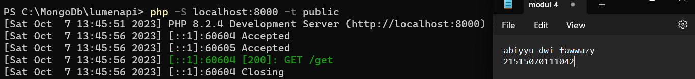
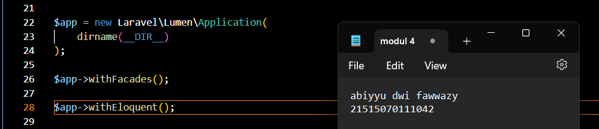
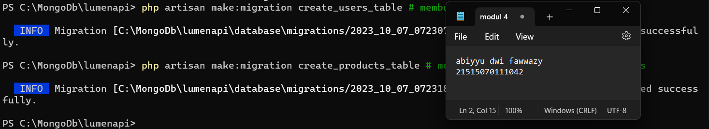
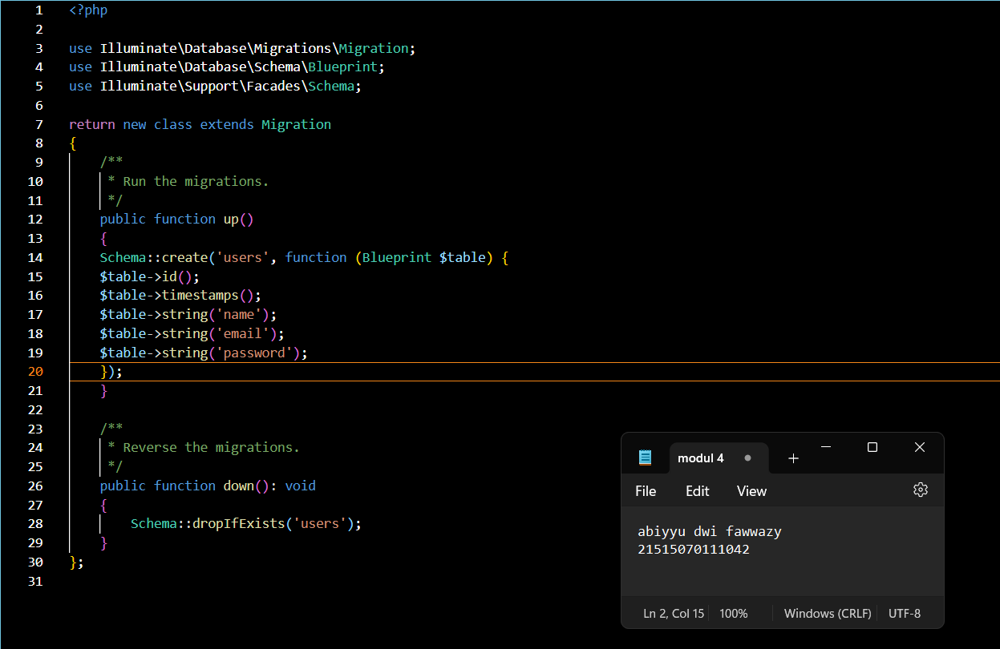
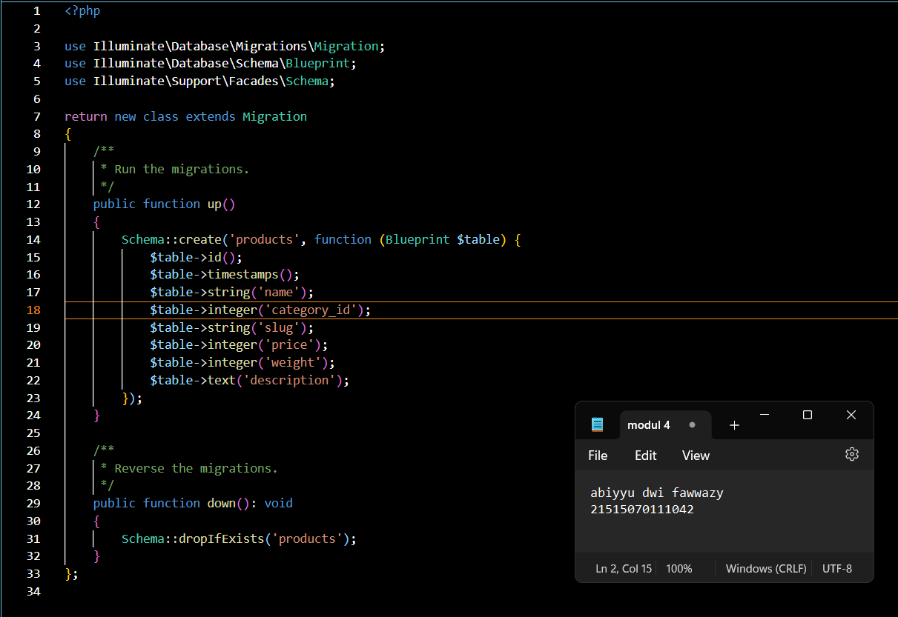

GET
Untuk menambahkan endpoint dengan method GET pada aplikasi kita, kita dapat
mengunjungi file web.php pada folder routes. Kemudian tambahkan baris ini pada akhir
file

POST, PUT, PATCH, DELETE, dan OPTIONS
Sama halnya saat menambahkan method GET, kita dapat menambahkan methode
POST, PUT, PATCH, DELETE, dan OPTIONS pada file web.php dengan code seperti
ini,

a. Kita dapat menginstall ekstensi dengan membuka panel extensions lalu mencari thunder client

b. Setelah menginstall Thunder Client, kita akan melihat logo seperti petir pada activity bar kita (sebelah kiri).

c. Kita dapat membuat request dengan menekan "New Request" pada ekstensi

d. Setelah itu kita dapat memasukkan method dan url yang dituju

Migrasi Database
a. Sebelum melakukan migrasi database pastikan server database aktif kemudian
pastikan sudah membuat database dengan nama lumenapi

b. Kemudian ubah konfigurasi database pada file .env menjadi seperti ini

c. Setelah mengubah konfigurasi pada file .env, kita juga perlu menghidupkan
beberapa library bawaan dari lumen dengan membuka file app.php pada folder
bootstrap dan mengubah baris ini,

d. Setelah itu jalankan command untuk membuat file migration,

e. Ubah fungsi up pada file migrasi create_users_table

f. Ubah fungsi up pada file migrasi create_products_table

