Pastikan terdapat tabel users yang dibuat menggunakan migration pada bab sebelumnya.
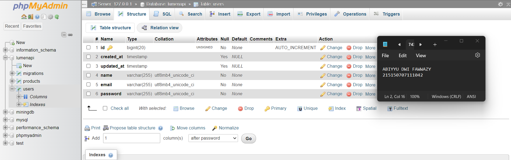

Bersihkan isi User.php yang ada sebelumnya dan isi dengan baris kode berikut
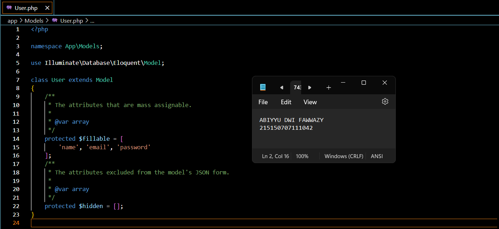

Controller
Buatlah salinan ExampleController.php pada folder app/Http/Controllers dengan nama HomeController.php dan buatlah fungsi index()
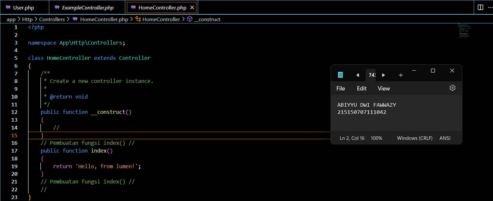

Ubah route / pada file routes/web.php menjadi seperti ini
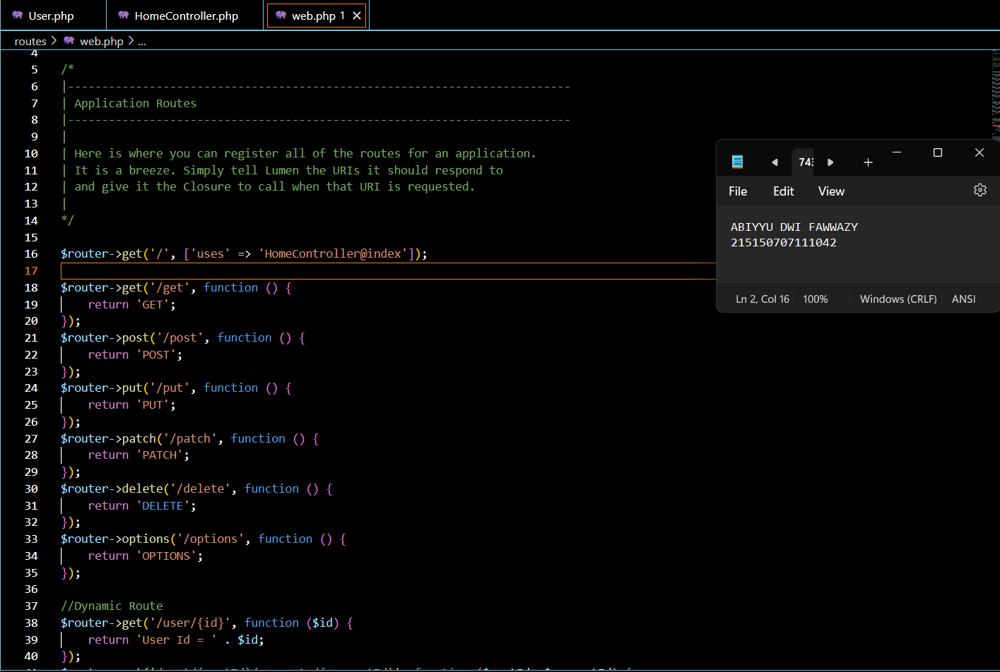

Jalankan aplikasi
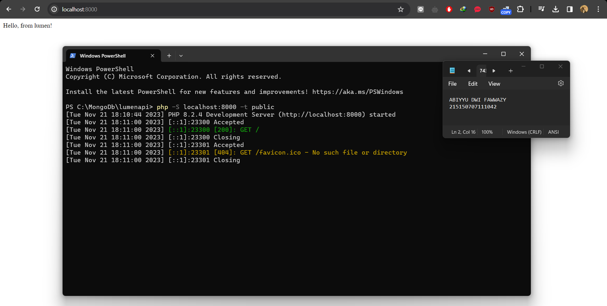

Request Handler
Lakukan import library Request dengan menambahkan baris berikut di bagian atas file
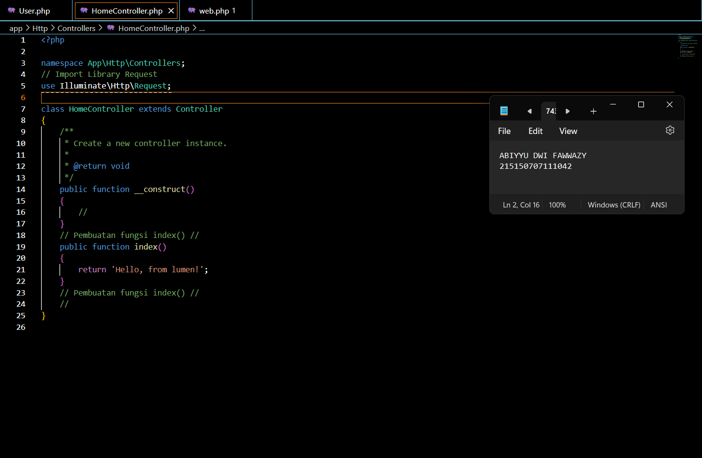

Ubah fungsi index menjadi
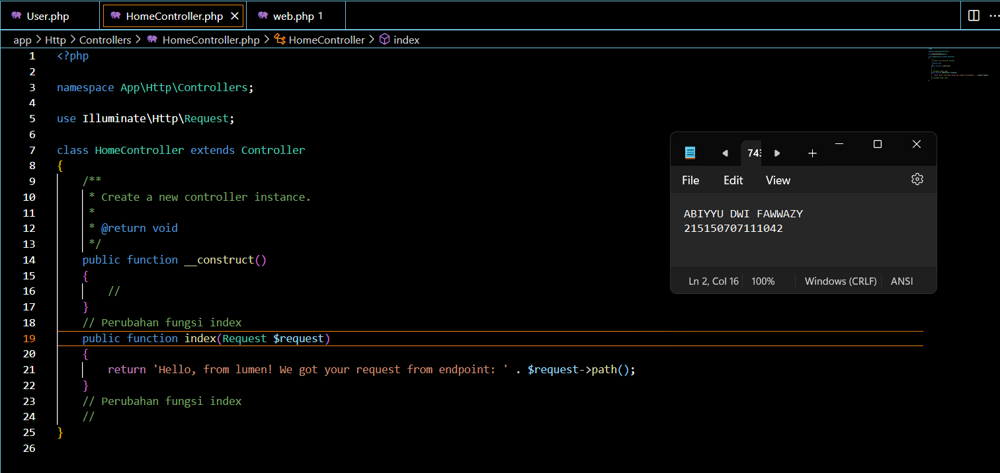

Jalankan aplikasi
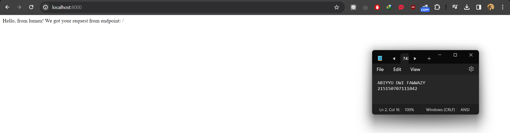

Response Handler
Lakukan import library Response dengan menambahkan baris berikut di bagian atas file
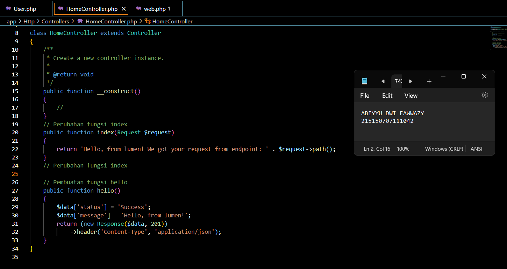

Jalankan aplikasi
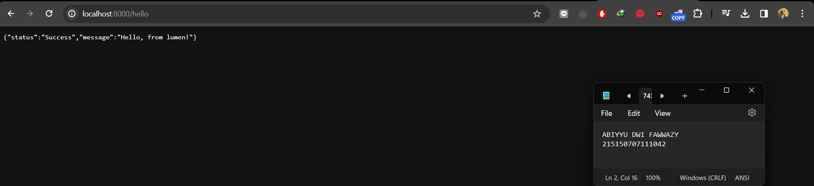

Penerapan
Lakukan import model User dengan menambahkan baris berikut di bagian atas file
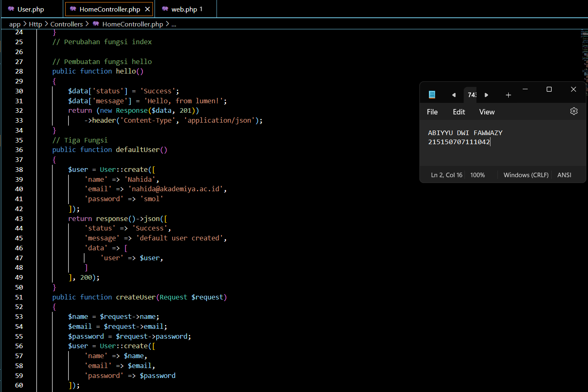

Jalankan aplikasi pada route /users/default menggunakan Postman
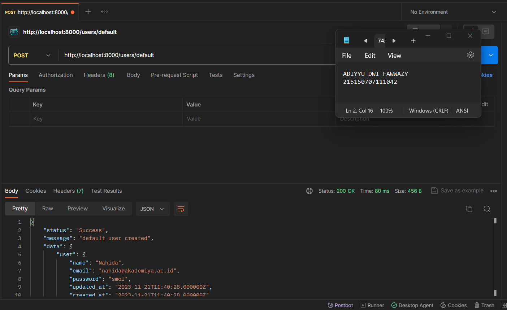

Jalankan aplikasi pada route /users/new dengan mengisi body
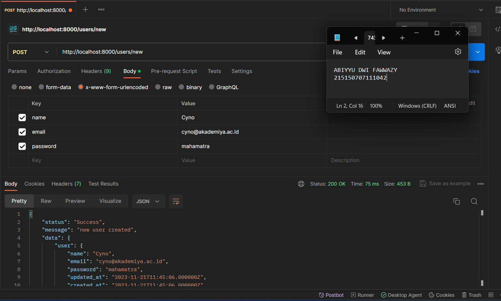

Jalankan aplikasi pada route /users/all
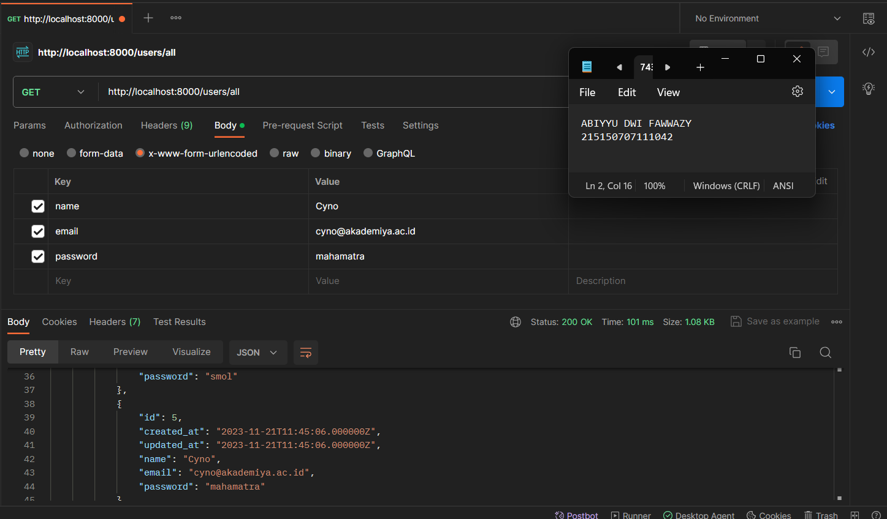