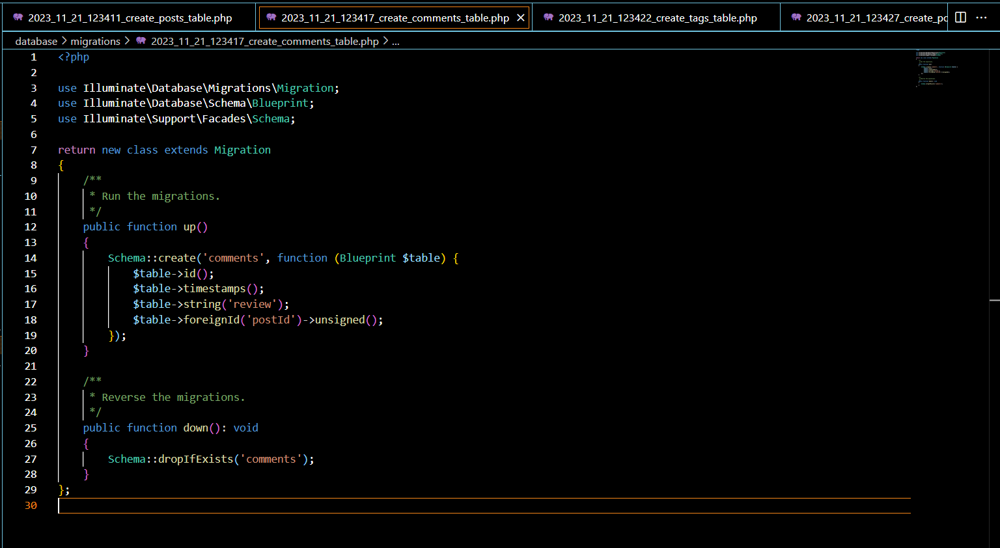
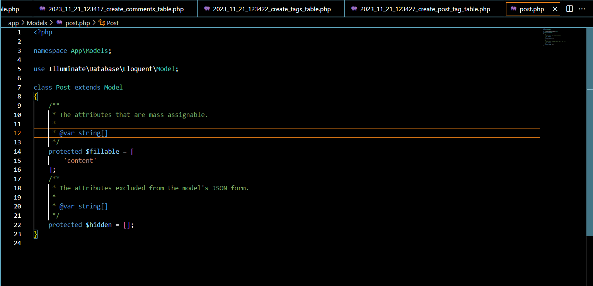

Sebelum membuat migrasi database atau membuat tabel pastikan server database aktif kemudian pastikan sudah membuat database dengan nama lumenpost

Setelah itu jalankan command berikut untuk membuat file migration

Ubah fungsi up() pada file migrasi create_posts_table

Ubah fungsi up() pada file create_comments_table

Ubah fungsi up() pada file create_tags_table

Ubah fungsi up() pada file create_post_tag_table

Kemudian jalankan command

Pembuatan Model
Buatlah file dengan nama Post.php dan isi dengan baris kode berikut

Buatlah file dengan nama Comment.php dan isi dengan baris kode berikut

Buatlah file dengan nama Tag.php dan isi dengan baris kode berikut

Relasi One-to-Many
Tambahkan fungsi comments() pada file Post.php

Tambahkan fungsi post() dan atribut postId pada $fillable pada file Comment.php

Buatlah file PostController.php dan isilah dengan baris kode berikut 

Buatlah file CommentController.php dan isilah dengan baris kode berikut

Tambahkan baris berikut pada routes/web.php

Buatlah satu post menggunakan Postman

Buatlah satu comment menggunakan Postman

Tampilkan post menggunakan Postman

Relasi Many-to-Many
Tambahkan fungsi tags() pada file Post.php

Tambahkan fungsi posts() pada file Tag.php

Buatlah file TagController.php dan isilah dengan baris kode berikut

Tambahkan fungsi addTag dan response tags pada PostController.php

Tambahkan baris berikut pada routes/web.php

Buatlah satu tag menggunakan Postman

Tambahkan tag “jadul” pada post “disana engkau berdua”

Tampilkan post “disana engkau berdua” menggunakan Postman

Buatlah postingan “tanpamu apa artinya” menggunakan Postman

Tambahkan tag “jadul” pada postingan “tanpamu apa artinya”

Buatlah tag “lagu” menggunakan Postman

Tambahkan tag “lagu” pada postingan “tanpamu apa artinya”

Tampilkan post pertama

Tampilkan post kedua
