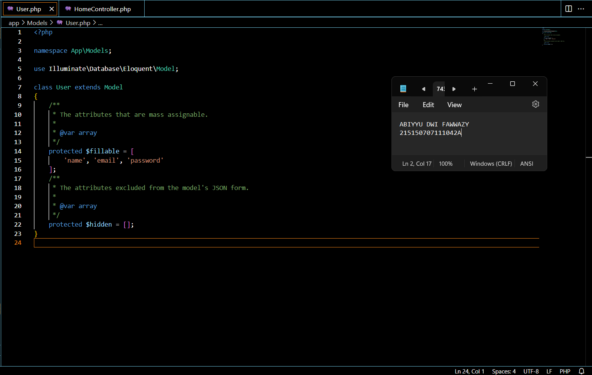

Register
Pastikan terdapat tabel users yang dibuat menggunakan migration pada bab 3 Basic Routing dan Migration.

Pastikan terdapat model User.php yang digunakan pada bab 5 Model, Controller dan Request-Response Handler.

Buatlah file AuthController.php dan isilah dengan baris kode berikut

Tambahkan baris berikut pada routes/web.php

Jalankan aplikasi pada endpoint /auth/register dengan body berikut

Authentication
Buatlah fungsi login(Request $request) pada file AuthController.php

Tambahkan baris berikut pada routes/web.php

Jalankan aplikasi pada endpoint /auth/login dengan body berikut

Token
Jalankan perintah berikut untuk membuat migrasi baru

Tambahkan baris berikut pada migration yang baru terbuat

Tambahkan atribut token di $fillable pada User.php

Tambahkan baris berikut pada file AuthController.php

Jalankan perintah di bawah untuk menjalankan migrasi terbaru

Jalankan aplikasi pada endpoint /auth/login dengan body berikut. Salinlah token yang didapat ke notepad

Authorization
Buatlah file Authorization.php pada folder App/Http/Middleware dan isilah dengan baris berikut

Tambahkan middleware yang baru dibuat pada bootstrap/app.php.

Buatlah fungsi home() pada HomeController.php

Tambahkan baris berikut pada routes/web.php

Jalankan aplikasi pada endpoint /home dengan melampirkan nilai token yang didapat setelah login pada header
