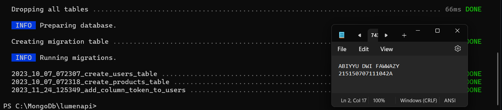
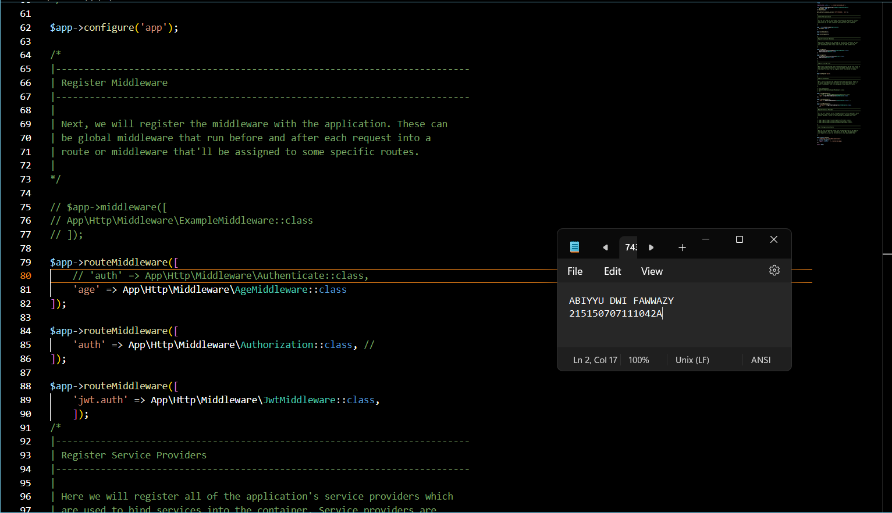

Lakukan perubahan pada length kolom token dengan menghapus parameter 72 di belakangnya

Jalankan perintah di bawah untuk memperbaharui migrasi dan menghapus data yang lama

Jalankan aplikasi pada endpoint /auth/register dengan body berikut.

JWT Manual
Tambahkan ketiga fungsi berikut pada AuthController.php

Lakukan perubahan pada fungsi login

Tambahkan keempat fungsi berikut pada Middleware/Authorization.php

Lakukan perubahan pada fungsi handle

Jalankan aplikasi pada endpoint /auth/login dengan body berikut. Salinlah token yang didapat ke notepad

Jalankan aplikasi pada endpoint /home dengan melampirkan nilai token yang didapat setelah login pada header

JWT Library
Lakukan generate jwt key secara online menggunakan website Djecrety ― Django Secret Key Generator

Lakukan instalasi package jwt firebase dengan menggunakan command berikut

Tambahkan fungsi berikut pada file AuthController

Lakukan perubahan pada fungsi login menjadi seperti berikut

Buatlah file JwtMiddleware.php dan isikan baris code berikut

Daftarkan middleware yang telah dibuat pada bootstrap/app.php

Tambahkan baris berikut pada file web.php

Jalankan aplikasi pada endpoint /auth/login dengan body berikut. Salinlah token yang didapat ke notepad
